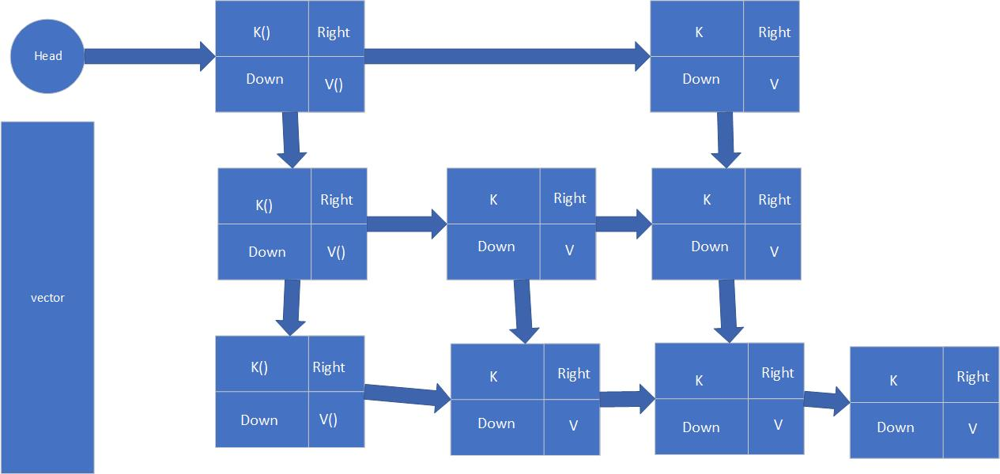

## 跳表的实现原理

### 插入

从第一行开始遍历，找到适合插入位置的前一个节点，压入vector，继续从down开始往前查，直到把每一行适合插入的位置的前一个节点都压入。

插入的时候，直接从保存的最底层节点开始插入，然后按概率升层，升层就将保存的节点继续拿出来插入到后面。如果保存的节点都插入完毕，此时再升层，就创建一个新的默认头节点，指向新创建的升层节点，down指针指向当前头节点。

### 删除

从最上层头节点开始，找到每一层该数据的前一个位置，然后去删除它，一直到最底层。

### 查找

从最上层头节点开始，递归向右查找。
